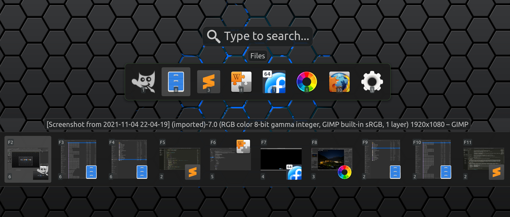
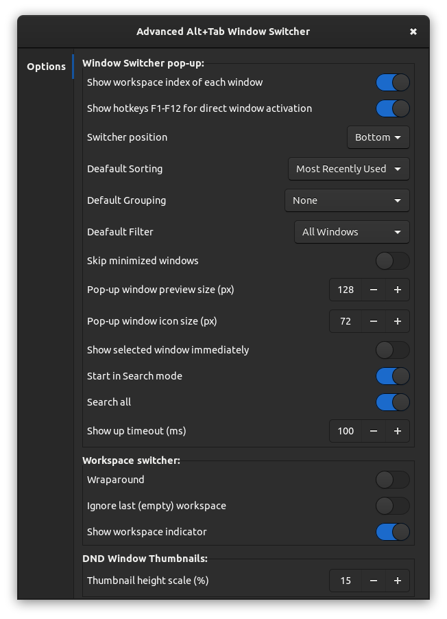

# Advanced Alt+Tab Window Switcher
Extension for Gnome Shell that replaces GNOME Shell's build-in functions *Switche windows*, *Switch applications* and *Switch windows of an application*

*Advanced Alt+Tab Window Switcher* offers effective navigation between windows, including type to search mode, various filtering and sorting settings, workspace switching and hotkeys for window control. With Custom Hot Corners - Extended extension this switcher can be also triggered and controlled using a mouse. 

## Features:

- replacement for both the window switcher and the application switcher. Both modes can be also switched on the fly.
- **Type to Search** mode - you can activate it by a hotkey or you can set in preferences to start the switcher directly in this mode so you can type immediately as the popup shows up.
- Optional default filter settings : *All windows / Current workspace / Current monitor*, plus *Skip minimized* option.
- Optional default sorting settings: *Most Recently Used* (MRU) */ Stable sequence / Stable sequence - current window first*.
- Optional automatic filter switching in search mode - the switcher can be set to list windows from the current monitor but you can find windows from other monitors and workspaces by typing.
- Optional default window grouping settings: *None / Current workspace first / Applications / Workspaces*.
- **Filtering, sorting and grouping modes can be switched on the fly** when needed.
- The switcher can work also as an **aplication launcher with Favorite applications** and search all installed applications (all with properly installed `.desktop` files).
- Built-in **workspace switcher** allows you to navigate between workspaces using the Up/Down arrow keys and optionally indicates the current WS with index.
- Separately **adjustable sizes** of window preview and app icon combo (the larger one is used as the base and the smaller one as the front icon), single application window list icons and application list icons.
- `Always on Top` property of selected window can be controled from the switcher and is indicated by the TOP position of the front icon (or the win preview if smaller) instead of default BOTTOM.
- The `view-pin` icon indicates whether the window is set as `Always on Visible Workspace` and you can control it from the switcher.
- Minimized windows are indicated by a reduced opacity of the front icon.
- Optional workspace index on each window item so you can see to which workspace the window belongs.
- Direct window activation using `F` keys with optional `F` key indicator on each window in the list.
- Optionally windows/applications can be brought to the front immediately as they are selected, otherwise you can do so by pressing a hotkey.
- With multimonitor setup **you can move the window switcher popup to any connected monitor** on the fly.
- Bult-in window and app control.
- Hotkey for creating **live window previews - thumbnails** that you can place anywhere on the screen and are always on top. This thumbnails can be adjusted using a mouse and you can use them as a shortcut that can activate or close the source window as described below. The thumbnail can also be switched into an aplication icon instead of the preview.

### Hotkeys

`H/L, Left/Right`         - window selection

`J/K, Up/Down, PgUp/Down` - workspace selection

`Shift + arrow keys`      - move the window switcher to the adjacent monitor in particular direction

`Ctrl+Tab`                - move the window switcher to next monitor, order is given by the Shell, Shift key changes direction

`Space, KP_0/KP_Ins`      - Show selected window - switch to window workspace and bring it to the front

`Q`                       - Switch window filter mode - ALL / WS / MONITOR

`;/~` (the key above Tab) - in Window mode - Sort windows by applications, each subsequent key press jumps to the first window of the next app
                          - in App mode - Iterate over windows of selected application

`G`                       - Toggle sort by workspaces, when base filter is set to ALL

`1/+/!`                   - Filter out all windows that don't belong to the application of selected window

`E/Insert`                - Activate the Search mode, the `Insert` key can turn it off.

`W`                       - Close selected window (or app when in app mode)

`D`                       - Close application of selected window (or app when in app mode)

`Shift+Del`               - Force close - kill -9 to application of selected window/app

`C`                       - Close all windows from the window list that belong to the same application as selected window

`A`                       - Toggle window 'Always on Top'. Also switch to window workspace and rise the window.
                           Indicated by the front icon on top instead of bottom.
                           When you press the 'A' key twice, it's actually equivalent to one press of hotkey for 'Show selected window'

`S`                       - Toggle window 'Always on Visible Workspace', indicated by the 'pin' icon

`X`                       - Move selected window to the current workspace and monitor
                            The current monitor is the one where the switcher popup is placed or where the mouse pointer is currently placed if the switcher was triggered by a mouse from the Custom Hot Corners - Extended extension.

`M`                       - Move selected window to the current workspace and monitor. The current monitor is the one as described above.

`N, Ctrl+Enter`           - Create a new window of selected application, if the app soupports it.

`F`                       - Move window to a new empty workspace next to its current workspace and switch the window to the fullscreen mode.
                           Next use of this action on the same window moves the window back to its original workspace and turn off the fullscreen mode.

`Z/Y, Ctrl+;/~`           - Toggle Windows and Applications modes.

`T`                       - Creates a thumbnail preview of selected window and place it to the bottom right of the current monitor. You can move the thumbnail anywhere on the screen and you can make as many thumbnails as you want
`P`                       - Open this extension preferences window.

`Ctrl+Shift+Left/Right`   - In Applications mode with Favorites, change the position of the selected favorite application

### Type to Search

If the `Search mode` is activated (by the `E` or `Insert` hotkeys or as the default mode in set in the preferences window), the `A-Z` and `0-9` keys can be used to enter a pattern to be searched in the window title, app name, app generic name (which usually contains short description of the aplication) and name of the app executable file, the window/app list will be filtered accordingly. Characters with diacritics in the title and app name will be converted to the basic form and case doesn't matter. You can also enter more patterns separated by a space in arbitrary order, so if you enter 'fox ext', a window with 'Extensions - Firefox' in the title will be also found. If you enter a character that would filter out all windows (no match), this character will be removed and the selection will stay unchanged waiting for another character. You can also enable to search for windows outside the current filter scope if no window was found in the current list. You can also enable searching applications in the windows mode, so you don't have to leave the window switcher to launch a new app.

**Even in the search mode you can use all hotkeys if you press and hold the Shift key**.

### DND Window Thumbnails

Window thumbnails are scaled-down window clones that can be used to monitor windows not currently visible on the screen. By pressing the `T` hotkey you can create a thumbnail of the selected window which will be placed at bottom right of the current monitor. You can create as many clones as you want and place them anywhere on the screen. Each thumbnail can be independently resized, you can adjust its opacity and even change its source window. When the thumbnail's source window is closed, its thumbnail will be removed too.

    Double click          - activates source window
    Primary cLick         - toggles scroll wheel function (resize / source)
    Scroll wheel          - resizes or switches a source window
    Ctrl + Scroll wheel   - switches source window or resizes
    Secondary click       - removes the thumbnail
    Middle click          - closes the source window
    Shift + Scroll wheel  - changes thumbnail opacity
    Ctrl + Primary button - toggles window preview to app icon
 
## Contribution

Contributions are welcome and I will try my best to answer quickly to all suggestions. Especially language corrections would be really helpful because my English is terrible.

 