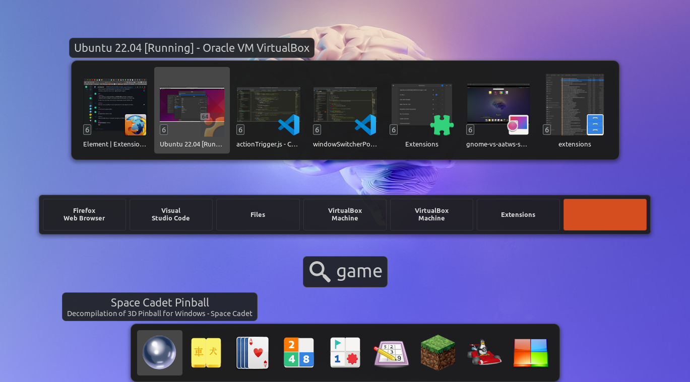
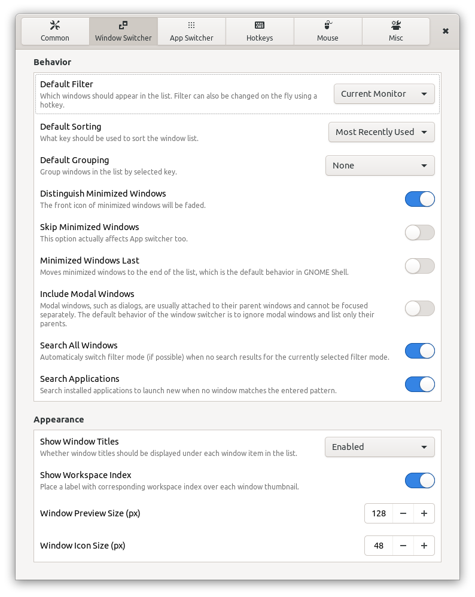
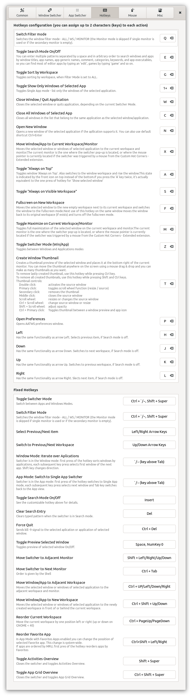

# AATWS - Advanced Alt-Tab Window Switcher
An extension for Gnome Shell that replaces following GNOME Shell's build-in functions: *Switch windows*, *Switch applications* and *Switch windows of an application*. Keyboard shortcuts for these functions can be set in GNOME Settings > Keyboard Shortcuts.

*AATWS - Advanced Alt-Tab Window Switcher* offers effective and highly customizable navigation between windows, workspaces, monitors and also window control. With the built-in type to search feature you don't even need to see what's in the switcher list to find your window or app instantly. App Switcher has also built-in app launcher and can find application even if you dont exacty know its name. In combination with `Custom Hot Corners - Extended` extension, the `AATWS` can be also triggered (and controled) using a mouse and also serve as a dock.

## Main Features:

- Supports GNOME Shell 3.36 - 42.
- Replacement for both the **Window Switcher** and **Application Switcher** popups. Both modes can be also switched on the fly.
- **Type to Search** mode which allows you to find any window or application.
- Optional default filter settings : *All windows / Current workspace / Current monitor*, plus *Skip minimized* option.
- Optional default sorting settings: *Most Recently Used* (MRU) */ Stable sequence / Stable sequence - current window first*.
- Optional automatic filter switching in search mode - the switcher can be set to list windows from the current monitor but you can find windows from other monitors and workspaces by typing.
- Optional default window grouping settings: *None / Current workspace first / Applications / Workspaces*.
- **Filter, sorting and grouping modes can be switched on the fly** when needed using hotkeys.
- The switcher can work also as an **aplication launcher with Favorite applications** and search all installed applications (all with properly installed `.desktop` files) and GNOME Settings. You can search applications not only by names, but also by their description, keywords, category and name of executable.
- Built-in **workspace switcher** with `Wraparound` and `Ingore Last (empty) Workspace` options allows you to navigate between workspaces using the Up/Down arrow keys.
- Separately **adjustable sizes** of window preview and app icon combo (the larger one is used as the base and the smaller one as the front icon), single application window list icons and application list icons.
- windows can be rised immediately as they are selected in the switcher list, otherwise you can do so by pressing a dedicated hotkey.
- With multimonitor setup **you can move the switcher popup to any connected monitor on the fly** using hotkeys. You can also choose whether the switcher should appear always on the primary monitor or the one with mouse pointer.
- Optional workspace index on each window item so you can see to which workspace the window belongs.
- Direct window activation using `F`unction keys with optional `F<n>` key indicator on each item in the switcher.
- Super key can be set to open App or Window switcher instead of the default Activities overview.
- Bult-in window and app controls, see Hotkeys paragraph below.

### Hotkeys

[A-Z] hotkeys can be customized in AATWS Preferences window, for each customizable action can be set up to two hotkeys for case you need to cover a non [a-zA-Z] keystroke with and without Shift modifier. You can disable any customizable hotkey by deleting its entry. Some core hotkeys cannot be customized nor disabled.

**Default configuration:**

| Hotkey | Description |
|------|---------------------------------|
|`H/L, Left/Right arrows`|  - Window selection|
|`J/K, Up/Down, PgUp/Down`| - Workspace selection|
|`Ctrl+[PgUp/Down]`|        - Reorder the current workspace - changes the workspace index -1/+1.|
|`Shift+Arrow keys`|      - Move the switcher popup to the adjacent monitor in corresponding direction.|
|`Ctrl+Tab`|                - Move the switcher popup to the next monitor, order is given by the Shell, Shift key changes direction.|
|`Space, KP_0/KP_Ins`|      - Toggle `Shows selected window` `Preview` mode on/off.|
|`Q, Ctrl+Super`|                       - Switch the window `Filter` mode - `ALL / WS / MONITOR` (the Monitor mode is skipped if single monitor is used or if the secondary monitor is empty).|
|`;/~ (the key above Tab)`| - In the Window mode - sort windows by application, each subsequent key press selects the first window of the next app. -In the Application mode - iterate over windows of the selected application, Tab switches back to apps.|
|`G`|                       - Toggle `Sort windows by workspace`, if `Filter` mode is set to `ALL`.|
|`1/+/!`|                   - Toggle `Single App` mode - shows only windows of the selected application.|
|`E/Insert`|                - Toggle the `Type to Search` mode. If the search mode is activated by the hotkey, you can relese the Alt key and the popup will not close. Selected item then must be activated using the `Enter` key, or you can close the popup without item activation using the Esc. `Del` key clears the entry.
|`W`|                       - `Close` the selected window or `Quit` selected application.|
|`Ctrl+W`|                  - Close the application of the selected window.|
|`Shift+Del`|               - Force Close - sends a `kill -9` signal to the application of selected window or to the selected application.|
|`C`|                       - Close all windows in the list that belong to the same application as the selected window.|
|`A`|                       - Toggle window `Always on Top` and also switch to window workspace and rise the window. - The `Above` state is indicated by the front icon at the top instead of the bottom.|
|`S`|                       - Toggle selected window `Always on Visible Workspace`. Ths state is indicated by the 'pin' icon at the top. Note, that this flag have all windows located on other than the primary monitor, when the GNOME Shell's option `Workspaces on Primary Display Only` is active.|
|`X`|             - Move selected window to the current workspace and monitor -The current monitor is the one where the switcher popup is placed or where the mouse pointer is currently placed if the switcher was triggered by a mouse from the Custom Hot Corners - Extended extension.|
|`M`|                       - Toggle full maximization of selected window on the current workspace and monitor. The current monitor is the one as described above.|
|`N, Ctrl+Enter`|           - Open new window of selected application, if the application soupports it.|
|`F`|                       - Move the selected window to a new empty workspace next to its current workspace and switches the window to the fullscreen mode. -Next use of this action on the same window moves the window back to its original workspace and turns off the fullscreen mode.|
|`Ctrl+;/~, Shift+Super`|    - Toggle between Windows and Applications modes.|
|`T`|                       - Create a thumbnail preview of the selected window and place it at the bottom right of the current monitor. You can remove the lastly created thumbnail using this hotkey while holding the `Ctrl` key pressed, or remove all created thumbnails while holding `Ctrl` and `Shift` keys pressed.|
|`P`|                       - Open preferences window for this extension.|
|`Ctrl+Up/Down/Left/Right`| - Move selected window/app to the adjacent workspace in front of or behind the current workspace.|
|`Ctrl+Shift+Up/Down`|      - Move selected window/app to the newly created workspace in front of or behind the current workspace.|
|`Ctrl+Shift+Left/Right`|   - In App mode with Favorites change the position of the selected favorite application in the Favorite apps list.|
|`Ctrl+Shift+Super`|        - Toggle Activities Overview|

### Type to Search

- If the `Search mode` is activated (by the `E` or `Insert` hotkeys or as the default mode in the preferences window), the `A-Z` and `0-9` keys can be used to enter the search pattern. The switcher window/app list is imediately filtered/repopulated accordingly.
- When you activate the Search mode using the hotkey, you can release the modifier keys used to activate the switcher (Alt, Super) and the switcher stays open. If the Search mode is active as default, relese of the modifier key activates the selected result as usual. If you activate the switcher using Super key, you have 5 seconds to start typing, or you can pres and release the `Ctrl` key to cancel the timeout.
- Characters with diacritics are converted to its basic form and case doesn't matter.
- You can also enter more patterns separated by a space in arbitrary order, so if you enter 'fox ext', a window with 'Extensions - Firefox' in the title will also be found. If you enter a character that would filter out all items (no match), this character will be removed and the selection will stays unchanged waiting for another character.
- AATWS is saerching in the window title, app name, app generic name (which usually contains information what type of application it is), description, keywords (not localized), categories (not localized) and name of the app executable file. Properties for apps comes from their `.desktop` launchers.
- Window search results are based not only on window titles but also on their app names and names of executable, so you can find all default file manager windows by typing `files` or even `nautilus`.
- Option `Search All Windows` for the Window Switcher allows AATWS to search for windows outside the current filter scope if no window was found with the current filter mode.
- YOption `Search Applications` for the Window Switcher allows AATWS to search applications in the Window switcher mode, so you don't have to leave the window switcher to launch a new app (if no window match the entered pattern).
- Search results in the application mode include installed applications and Gnome Settings Sections (they have their own launchers).
- In the App Switcher if no app match the entered pattern, windows are searched automatically.
- Application search results add generic name (if different from name) and description to the name in icon tooltips to help identify unknown apps.
- Option `Max Number of Search Results` for App Switcher limits output of search engine. Default is 12.
- Application search results are weighted by the following criteria (in this order): position in the list of frequently used applications, app name starts with the pattern, any word in the item name/description/category/executable starts with the pattern. This means that you can very quicky and consistently find apps if you know their names, mostly using just one letter.
- Window search results are weighted by the following criteria (in this order): app name starts with the pattern, any word in the window title/app name/executable starts with the pattern.

**Even in the search mode you can use all hotkeys if you press and hold the Shift modifier key**.

### DND Window Thumbnails

Window thumbnails are scaled-down window clones that can be used to monitor windows not currently visible on the screen. By pressing the `T` hotkey (which you can change) you can create a thumbnail of the selected window which will be placed at bottom right of the current monitor. You can create as many clones as you want and place them anywhere on the screen. Each thumbnail can be independently resized, you can adjust its opacity and even change its source window. When the thumbnail's source window is closed, its thumbnail will be removed too.
You can remove the lastly created thumbnail using `Ctrl + T` or remove all thumbnails using `Ctrl + Shift + T`.

    Double click          - activates source window
    Primary cLick         - toggles scroll wheel function (resize / source)
    Scroll wheel          - resizes or switches a source window
    Ctrl + Scroll wheel   - switches source window or resizes
    Secondary click       - removes the thumbnail
    Middle click          - closes the source window
    Shift + Scroll wheel  - changes thumbnail opacity
    Ctrl + Primary button - toggles window preview to app icon

Known bugs: when the thumbnail is created above VirtualBox virtual machine window, the thumbnail becomes irresponsive.

## Changelog

[CHANGELOG.md](CHANGELOG.md)

## Installation

You can install this extension in several ways.

### Installing from extensions.gnome.org

The easiest way to install AATWS: go to [extensions.gnome.org](https://extensions.gnome.org/extension/4412/advanced-alttab-window-switcher/) and toggle the switch. This installation also gives you automatic updates in the future.

### Installing from the latest Github release

Download the latest release archive using following command:

    wget https://github.com/G-dH/advanced-alttab-window-switcher/releases/latest/download/advanced-alt-tab@G-dH.github.com.zip

Install the extension (`--force` switch needs to be used only if some version of the extension is already installed):

    gnome-extensions install --force advanced-alttab-window-switcher@G-dH.github.com.zip

Then restart GNOME Shell (`ALt` + `F2`, `r`, `Enter`, or Log Out/Log In if you use Wayland). Now you should see the new extension in *Extensions* (or *GNOME Tweak Tool* on older systems) application (reopen the app too if needed to load new data), where you can enable it and access its Preferences. 

You can also enable the extension from the command line:

    gnome-extensions enable advanced-alt-tab@G-dH.github.com

## Contribution

Contributions are welcome and I will try my best to answer quickly to all suggestions. I'd really appreciate corrections of my bad english.

If you like my work and want to keep me motivated, give me some feedback. You can also [buy me a coffee](buymeacoffee.com/georgdh).

## Screenshots

 