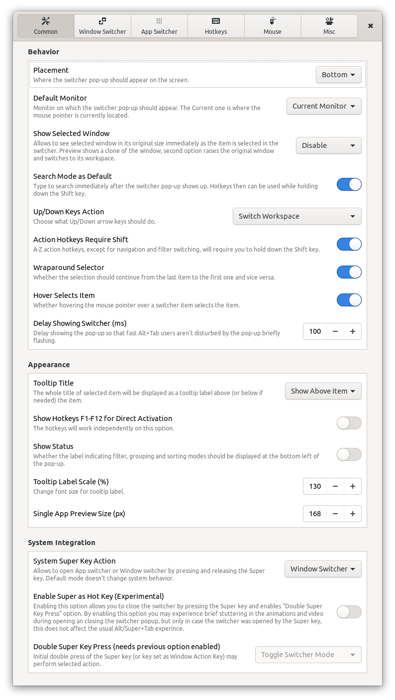

# AATWS - Advanced Alt-Tab Window Switcher
An extension for Gnome Shell that replaces following GNOME Shell's build-in functions: *Switch windows*, *Switch applications* and *Switch windows of an application*. Keyboard shortcuts for these functions can set in GNOME Settings > Keyboard Shortcuts.

*AATWS - Advanced Alt-Tab Window Switcher* offers effective navigation between windows, including type to search mode, various filtering and sorting options, workspace switcher and hotkeys for window control. In combination with `Custom Hot Corners - Extended` extension, `AATWS` can be also triggered (and controlled) using a mouse.

## Features:

- Supports GNOME Shell 3.36 - 41.
- Replacement for both the window switcher and application switcher. Both modes can be also switched on the fly.
- **Type to Search** mode - you can activate it by a hotkey or you can set in preferences to start the switcher directly in this mode so you can type immediately as the popup shows up.
- Optional default filter settings : *All windows / Current workspace / Current monitor*, plus *Skip minimized* option.
- Optional default sorting settings: *Most Recently Used* (MRU) */ Stable sequence / Stable sequence - current window first*.
- Optional automatic filter switching in search mode - the switcher can be set to list windows from the current monitor but you can find windows from other monitors and workspaces by typing.
- Optional default window grouping settings: *None / Current workspace first / Applications / Workspaces*.
- **Filter, sorting and grouping modes can be switched on the fly** when needed.
- The switcher can work also as an **aplication launcher with Favorite applications** and search all installed applications (all with properly installed `.desktop` files) and GNOME Settings.
- Built-in **workspace switcher** allows you to navigate between workspaces using the Up/Down arrow keys and optionally indicates the current workspace by on screen index.
- Separately **adjustable sizes** of window preview and app icon combo (the larger one is used as the base and the smaller one as the front icon), single application window list icons and application list icons.
- `Always on Top` property of selected window can be controled from the switcher and is indicated by the TOP position of the front icon (or the win preview if smaller) instead of default BOTTOM.
- The `view-pin` icon indicates whether the window is set as `Always on Visible Workspace` and you can control it from the switcher.
- Minimized windows are indicated by a reduced opacity of the icon.
- Optional workspace index on each window item so you can see to which workspace the window belongs.
- Direct window activation using `F` keys with optional `F<n>` key indicator on each item in the list.
- Optionally windows can be rised immediately as they are selected in the switcher list, otherwise you can do so by pressing a dedicated hotkey.
- With multimonitor setup **you can move the window switcher popup to any connected monitor on the fly**.
- Bult-in window and app controls, see Hotkeys paragraph below.
- Hotkey for creating **live window previews - thumbnails** that you can place anywhere on the screen and are always on top. This thumbnails can be adjusted using a mouse and you can use them as a shortcut that can activate or close the source window as described below. The thumbnail can also be switched into an aplication icon instead of the preview.

### Hotkeys

Most hotkeys can be customized in AATWS Preferences window, for each customizable action can be set up to two hotkeys for case you need to cover a non [a-zA-Z] keystroke with and without Shift modifier. You can disable any customizable hotkey by deleting its entry. Some core hotkeys cannot be customized nor disabled.

**Default configuration:**

`H/L, Left/Right arrows`  - Window selection

`J/K, Up/Down, PgUp/Down` - Workspace selection

`Ctrl+[PgUp/Down]`        - Reorders the current workspace - changes the workspace index -1/+1.

`Shift + arrow keys`      - Moves the switcher popup to the adjacent monitor in corresponding direction.

`Ctrl+Tab`                - Moves the switcher popup to the next monitor, order is given by the Shell, Shift key changes direction.

`Space, KP_0/KP_Ins`      - Shows selected window - switches to the window workspace and rises the window.

`Q`                       - Switches the window filter mode - ALL / WS / MONITOR (the Monitor mode is skipped if single monitor is used or if the secondary monitor is empty).

`;/~` (the key above Tab) - In the Window mode - sorts windows by application, each subsequent key press jumps to the first window of the next app.
                          - In the Application mode - iterates over windows of the selected application, Tab switches back to apps.

`G`                       - Toggles sorting by workspace, when Filter Mode is set to ALL.

`1/+/!`                   - Toggles Single App mode - shows only the windows of the selected application.

`E/Insert`                - Toggles the `Type to Search` mode. If the search mode is activated by the hotkey, you can relese the Alt key and the popup will not close. Selected item then must be activated using the `Enter` key, or you can close the popup without item activation using the Esc. `Del` key clears the entry.

`W`                       - Closes the selected window or application.

`Ctrl+W`                  - Closes the application of the selected window.

`Shift+Del`               - Force close - sends a `kill -9` signal to the application of selected window or to the selected application.

`C`                       - Closes all windows in the list belonging to the same application as the selected window.

`A`                       - Toggles window 'Always on Top'. Also switches to window workspace and rise the window.
                            This state is indicated by the front icon at the top instead of the bottom.
                            If you press the 'A' key twice, it's actually equivalent to the one press of the hotkey for `Show selected window`

`S`                       - Toggles selected window `Always on Visible Workspace`, indicated by the 'pin' icon.

`X`                       - Moves selected window to the current workspace and monitor
                            The current monitor is the one where the switcher popup is placed or where the mouse pointer is currently placed if the switcher was triggered by a mouse from the Custom Hot Corners - Extended extension.

`M`                       - Toggles full maximization of selected window on the current workspace and monitor. The current monitor is the one as described above.

`N, Ctrl+Enter`           - Create a new window of selected application, if the application soupports it.

`F`                       - Moves the selected window to a new empty workspace next to its current workspace and switches the window to the fullscreen mode.
                            Next use of this action on the same window moves the window back to its original workspace and turns off the fullscreen mode.

`Y, Ctrl+;/~`             - Toggles between Windows and Applications modes.

`T`                       - Creates a thumbnail preview of the selected window and places it at the bottom right of the current monitor. You can move the thumbnail anywhere on the screen using a mouse and you can make as many thumbnails as you want
`P`                       - Opens preferences window of this extension.

`Ctrl+Shift+Left/Right`   - In Applications mode with Favorites, changes the position of the selected favorite application

### Type to Search

If the `Search mode` is activated (by the `E` or `Insert` hotkeys or as the default mode in the preferences window), the `A-Z` and `0-9` keys can be used to enter a pattern to be searched in the window title, app name, app generic name (which usually contains short description of the aplication) and name of the app executable file, the window/app list will be filtered accordingly. Characters with diacritics in the title and app name will be converted to its basic form and case doesn't matter. You can also enter more patterns separated by a space and in arbitrary order, so if you enter 'fox ext', a window with 'Extensions - Firefox' in the title will be also found. If you enter a character that would filter out all windows (no match), this character will be removed and the selection will stay unchanged waiting for another character. You can also enable an option that allows the AATWS to search for windows outside the current filter scope if no window was found in the current list. You can also enable searching applications in the windows mode, so you don't have to leave the window switcher to launch a new app (if now window match the pattern). Search results in the application mode contain installed applications and Gnome Settings categories and if no application was found automatically searches windows.

**Even in the search mode you can use all hotkeys if you press and hold the Shift modifier key**.

### DND Window Thumbnails

Window thumbnails are scaled-down window clones that can be used to monitor windows not currently visible on the screen. By pressing the `T` hotkey you can create a thumbnail of the selected window which will be placed at bottom right of the current monitor. You can create as many clones as you want and place them anywhere on the screen. Each thumbnail can be independently resized, you can adjust its opacity and even change its source window. When the thumbnail's source window is closed, its thumbnail will be removed too.

    Double click          - activates source window
    Primary cLick         - toggles scroll wheel function (resize / source)
    Scroll wheel          - resizes or switches a source window
    Ctrl + Scroll wheel   - switches source window or resizes
    Secondary click       - removes the thumbnail
    Middle click          - closes the source window
    Shift + Scroll wheel  - changes thumbnail opacity
    Ctrl + Primary button - toggles window preview to app icon

Known bugs: when the thumbnail is created above VirtualBox virtual machine window, the thumbnail becomes irresponsive.

## Chanchelog

### v11 (not yet released on e.g.o.):
**Added:**
- actions `Move selected to previous/next workspace` and `Move selected to previous/next workspace`.
- some missing fixed hotkeys in the Preferences window.
- option `Minimized windows at the end` of the list (default for GNOME Shell is `true`).
- `Super Key Mode` option can override default Super key functionality and instead of Activities open App or Window Switcher, which then stays open until you choose an item or escape. If you want to activate Overview, press and hold any other modifier key and hit the (left) Super again. Sadly, the Super press event cannot be catched by the AATWS unless you simultaneously press and hold any other modifier key.
- when searching apps, the tooltip title (if enabled) of selected application adds its `generic_name`, which usually contains short app description.
- option for app switcher `Raise First Window Only` - on app activation raise only its most recently used window instead of all app windows.

**Other Changes**
- tooltips replaced by captions directly under each option

### v10:

**Added:**
- Configurable hotkeys
- Option `Hover Selects item` - allows to disable select item by hovering mouse.
**Improved:**
- Search prefers words and titles starting with entered pattern
**Fixed:**
- `Fullscreen Selected on Empty WS` action - restore window on removed workspace crashes GS.
- Unaccessible items if `Show selected window/app imediately` is enabled and the switcher popup is wider than screen.
- Filter not shared between `Window` and `App` modes before the filter is switched.
- Global variables mess

## Contribution

Contributions are welcome and I will try my best to answer quickly to all suggestions. I'd really appreciate corrections of my bad english.

## Screenshots

 